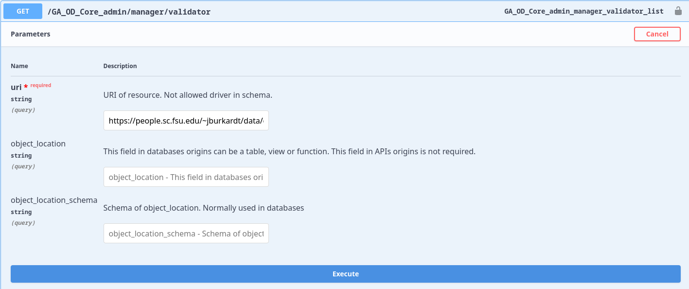
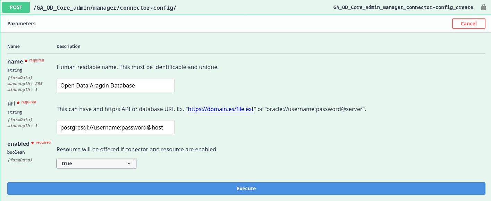
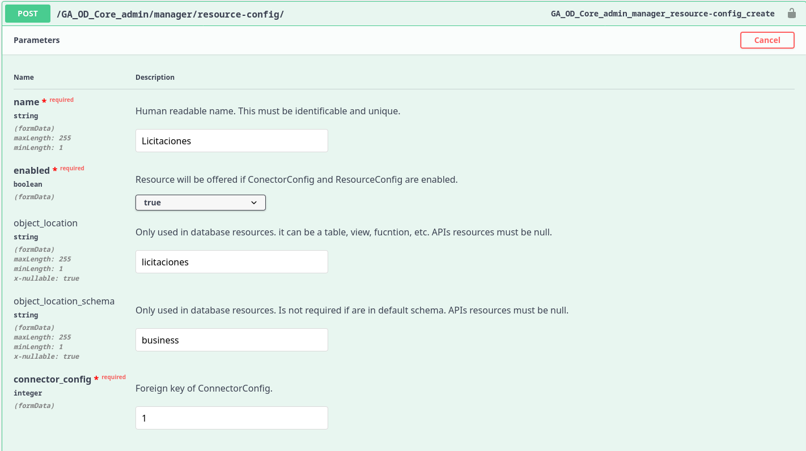

# GAODCore

_"Gobierno de Aragón Open Data Core"_ is an app that allow to interact with public resources of _Gobierno de Aragón_.

## Terminology

- Resource: any kind of data that user can download. Origin of this data can be produced from only one or mix of APIs,
  database tables, database views, database functions, etc. *View* is deprecated alias of resource. Motives of this
  deprecation are confusion with database views and use a consistent terminology with _CKAN_.
- Connector: any way to connect with external resources.

## APPs

To discover all endpoints please check following
swagger: [https://opendata.aragon.es/GA_OD_Core/ui/](https://opendata.aragon.es/GA_OD_Core/ui/)

- **default**: Public APP that allow that provide public data of _Gobieno de Aragón_.
  Directory: [/GA_OD_Core/](/GA_OD_Core/)
- **transports**: Public APP that provide different endpoints to get data of transports of _Aragón_.
  Directory: [/GA_OD_Core/gaodcore-transports](/GA_OD_Core/gaodcore-transports)
- **admin**: Private APP that allow to manage authentication and authorization. Directory:
  [/GA_OD_Core_admin/admin](/GA_OD_Core_admin/admin)
- **manager**: Private APP that allow to manage _gaodcore_ functionalities. This app is hidden in swagger if you are not
  session authenticated. Directory: [/GA_OD_Core_admin/manager](/GA_OD_Core_admin/manager)

## Despliegue

Es importante poner un timeout generoso 4m ya que si hay alguna peticion no cacheada dara un error. Si se utiliza Apache como proxy revisar timeout https://httpd.apache.org/docs/2.4/mod/mod_proxy.html 

## Usage

### Authentication

Currently, it is allowed Session and Basic authentication.

#### Session Authentication

This is util to show **manager** app in swagger. You can authenticate graphically here:
[/GA_OD_Core_admin/admin/](/GA_OD_Core_admin/admin/)

#### Basic Authentication

This is util to deal with manager app and integrate other app with GAODCore. For more information:
[https://en.wikipedia.org/wiki/Basic_access_authentication](https://en.wikipedia.org/wiki/Basic_access_authentication)

### Create a new resource

#### Validate a new Resource

It is posible to get data without create any configuration to test if data is correct before create any configuration.
Take care that when you create a `ConnectorConfig` or `ResourceConfig` will check if resource is available. Not availability 
of a resource will raise an error.

In [/GA_OD_Core_admin/manager/validator/](/GA_OD_Core_admin/manager/validator/) you must send a GET
authenticated request with following data:

Swagger
URL: [/GA_OD_Core/ui/#operations-manager-GA_OD_Core_admin_manager_validator_list](/GA_OD_Core/ui/#operations-manager-GA_OD_Core_admin_manager_validator_list)

#### Create a new ConnectorConfig
Create a `ConnectorConfig` is the way to explain how GAODCore must connect with an external resource: api or database.
This step not include retrieval of data.

In [/GA_OD_Core_admin/manager/connector-config/](/GA_OD_Core_admin/manager/connector-config/) you must send a POST
authenticated request with following data:

Swagger
URL: [/GA_OD_Core/ui/#operations-manager-GA_OD_Core_admin_manager_resource-config_create](/GA_OD_Core/ui/#operations-manager-GA_OD_Core_admin_manager_resource-config_create)

#### Create a new ResourceConfig

Create a `ResourceConfig` is the way to explain what data GAODCore must retrieve. 

In [/GA_OD_Core_admin/manager/resource-config/](/GA_OD_Core_admin/manager/resource-config/) you must send a POST 
authenticated request with following data:

Swagger
URL: [/GA_OD_Core/ui/#operations-manager-GA_OD_Core_admin_manager_resource-config_create](/GA_OD_Core/ui/operations-manager-GA_OD_Core_admin_manager_resource-config_create)

### Data retrieval 

To discover all endpoints please check following
swagger: [GA_OD_Core/ui/](GA_OD_Core/ui/)

### Reset login attempts

If we try to access our account unsuccessfully multiple times, our account will be locked an the next message will appear:
    
    Access locked: too many login attempts. Contact an admin to unlock your account.

If we want to reset these attempts, we have to execute one of the next commands (depending on the case) inside the docker container:

    python manage.py axes_reset
    python manage.py axes_reset_ip [ip ...]
    python manage.py axes_reset_username [username ...]
    python manage.py axes_reset_logs (age)

The first one will reset all lockouts and access records. The second one  will clear lockouts and records for the given IP addresses. The third one will clear lockouts and records for the given usernames. And finally, the last one will reset AccessLog records that are older than the given age where the default is 30 days.
