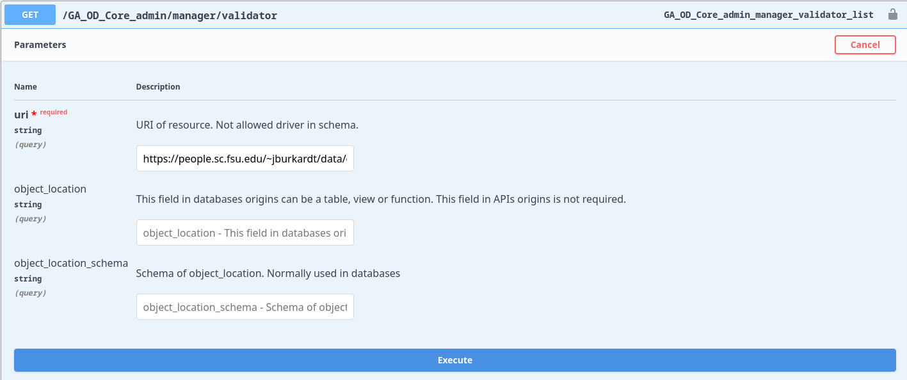
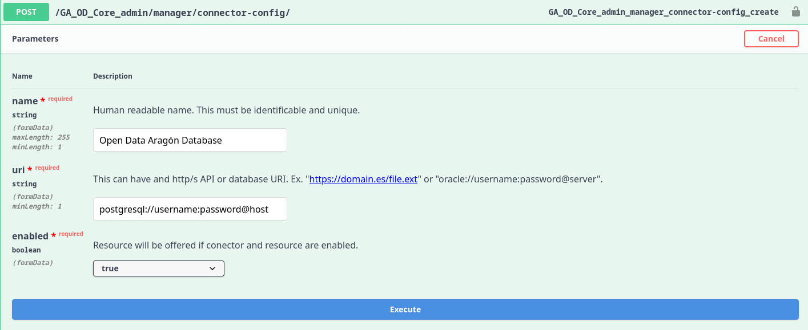
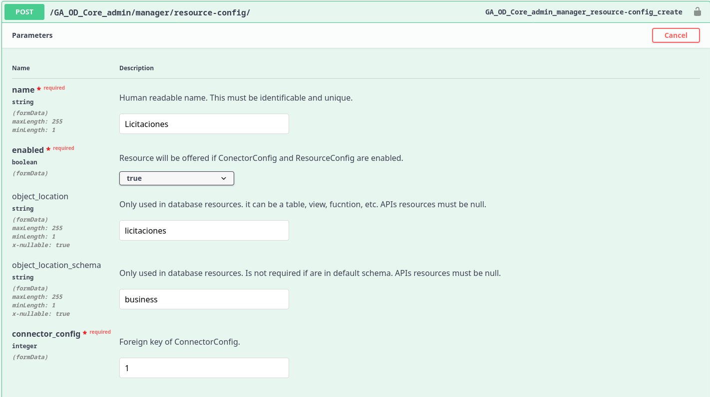

# GAODCore

_"Gobierno de Aragón Open Data Core"_ is an app that allow to interact with public resources of _Gobierno de Aragón_.


## Terminology

- Resource: any kind of data that user can download. Origin of this data can be produced from only one or mix of APIs,
  database tables, database views, database functions, etc. *View* is deprecated alias of resource. Motives of this
  deprecation are confusion with database views and use a consistent terminology with _CKAN_.
- Connector: any way to connect with external resources.

## APPs

To discover all endpoints please check following
swagger: [https://opendata.aragon.es/GA_OD_Core/ui/](https://opendata.aragon.es/GA_OD_Core/ui/)

- **default**: Public APP that allow that provide public data of _Gobieno de Aragón_.
  Directory: [/GA_OD_Core/](/GA_OD_Core/)
- **transports**: Public APP that provide different endpoints to get data of transports of _Aragón_.
  Directory: [/GA_OD_Core/gaodcore-transports](/GA_OD_Core/gaodcore-transports)
- **admin**: Private APP that allow to manage authentication and authorization. Directory:
  [/admin/GA_OD_Core_admin/admin](/admin/GA_OD_Core_admin/admin)
- **manager**: Private APP that allow to manage _gaodcore_ functionalities. This app is hidden in swagger if you are not
  session authenticated. Directory: [/admin/GA_OD_Core_admin/manager](/admin/GA_OD_Core_admin/manager)

## Despliegue

Es importante poner un timeout generoso 4m ya que si hay alguna peticion no cacheada dara un error. Si se utiliza Apache como proxy revisar timeout https://httpd.apache.org/docs/2.4/mod/mod_proxy.html

## Environment Variables

| Variable | Description | Default |
|----------|-------------|---------|
| `CONFIG_PATH` | Path to the external YAML configuration file | — |
| `DJANGO_LOG_LEVEL` | Logging level for the application (Django, gaodcore) | `WARNING` |
| `SQLALCHEMY_LOG_LEVEL` | Logging level for SQLAlchemy (database engine logs) | `ERROR` |

## Development

### Code Quality

This project uses pre-commit hooks with Ruff for code linting and quality checks.

#### Setup pre-commit

```bash
pip install pre-commit
pre-commit install
```

The hooks will automatically run on each commit to ensure code quality standards.

## Usage

### Authentication

Currently, it is allowed Session and Basic authentication.

#### Session Authentication

This is util to show **manager** app in swagger. You can authenticate graphically here:
[/admin/GA_OD_Core_admin/admin/](/admin/GA_OD_Core_admin/admin/)

#### Basic Authentication

This is util to deal with manager app and integrate other app with GAODCore. For more information:
[https://en.wikipedia.org/wiki/Basic_access_authentication](https://en.wikipedia.org/wiki/Basic_access_authentication)

### API Error Responses

Errors are returned as an [RFC 9457](https://www.rfc-editor.org/rfc/rfc9457) problem
document, served with the `application/problem+json` media type. This is true for every
format a client may ask for: an error to a CSV, SCSV, XLSX, YAML or XML request is still
a problem document, never a table or a spreadsheet. The browsable API is the only
exception and keeps rendering HTML.

```json
{
  "type": "https://opendata.aragon.es/problems/connection-unavailable",
  "title": "Connection unavailable",
  "status": 503,
  "detail": "Connection is not available.",
  "error_code": "CONNECTION_UNAVAILABLE"
}
```

| Member | Notes |
|--------|-------|
| `type` | Stable identifier of the problem kind. Treat it as an opaque identifier: these URIs are **not** resolvable today, so do not dereference them. |
| `title` | Short, human-readable summary of the problem kind. |
| `status` | Always equal to the HTTP status code of the response. |
| `detail` | Human-readable explanation. Always a string, never a field-error map. |
| `error_code` | **Extension member** (project-specific). |
| `errors` | **Extension member** (project-specific), present on validation errors only. |

`error_code` and `errors` are *extension members*, which RFC 9457 explicitly allows a
problem document to add next to the standard members (the RFC itself shows an example
carrying an `errors` extension). Adding them therefore does not make the document any
less of an RFC 9457 problem document.

`error_code` gives clients a short, stable token to branch on without parsing `type`;
clients that only understand the standard members can ignore both extensions and still
read `type`, `title`, `status` and `detail`.

**Validation errors** carry the structured, per-field detail under `errors`, keyed by
field name: each leaf holds the human-readable `message` and the DRF validation `code`.
Messages not tied to a field are grouped under `non_field_errors`. Nested serializers and
`many=True` serializers keep their shape, so nothing is lost:

```json
{
  "type": "https://opendata.aragon.es/problems/validation-error",
  "title": "Validation error",
  "status": 400,
  "detail": "The request contains invalid fields.",
  "error_code": "VALIDATION_ERROR",
  "errors": {
    "uri": [
      {
        "message": "Connection is not available.",
        "code": "CONNECTION_UNAVAILABLE"
      }
    ]
  }
}
```

On a validation problem the top-level `error_code` is always `VALIDATION_ERROR` and
`detail` is the generic *The request contains invalid fields.*; the specific semantic code
(here `CONNECTION_UNAVAILABLE`) lives inside `errors`, next to the field it belongs to.

Keeping field errors inside `errors` also means a resource with a field literally named
`status`, `detail`, `error_code` or `errors` can never overwrite the envelope.

**HTTP status codes:**

| Status | Exception | Meaning |
|--------|-----------|---------|
| 400 | `ValidationError` | Client error - invalid input, request or missing resource |
| 502 | `BadGateway` | External API or service failure |
| 503 | `ServiceUnavailable` | Database or connector unavailable |

**Error codes:**
- `VALIDATION_ERROR` - The request contains invalid fields; see `errors`
- `CONNECTION_UNAVAILABLE` - Database/connector connection failed
- `OBJECT_UNAVAILABLE` - Table, view, or function doesn't exist
- `RESOURCE_UNAVAILABLE` - Resource does not exist or is not enabled
- `QUERY_ERROR` - Query execution failed
- `SCHEMA_NOT_IMPLEMENTED` - Requested schema type not supported
- `BAD_GATEWAY` - Upstream service failed

`type` and `title` are derived from `error_code`: the type is
`https://opendata.aragon.es/problems/` followed by the lower-case, dash-separated code,
and the title is the code in sentence case. The resulting URI is stable and safe to match
on, but it is an identifier only: nothing is published at that address.

### Create a new resource

#### Validate a new Resource

It is posible to get data without create any configuration to test if data is correct before create any configuration.
Take care that when you create a `ConnectorConfig` or `ResourceConfig` will check if resource is available. Not availability
of a resource will raise an error.

In [/admin/GA_OD_Core_admin/manager/validator/](/admin/GA_OD_Core_admin/manager/validator/) you must send a GET
authenticated request with following data:


Swagger
URL: [/admin/GA_OD_Core_admin/ui/#operations-manager-admin_GA_OD_Core_admin_manager_validator_retrieve](/admin/GA_OD_Core_admin/ui/#operations-manager-admin_GA_OD_Core_admin_manager_validator_retrieve)


#### Create a new ConnectorConfig
Create a `ConnectorConfig` is the way to explain how GAODCore must connect with an external resource: api or database.
This step not include retrieval of data.

In [/admin/GA_OD_Core_admin/manager/connector-config/](/admin/GA_OD_Core_admin/manager/connector-config/) you must send a POST
authenticated request with following data:


Swagger
URL: [/admin/GA_OD_Core_admin/ui/#operations-manager-admin_GA_OD_Core_admin_manager_connector_config_create](/admin/GA_OD_Core_admin/ui/#operations-manager-admin_GA_OD_Core_admin_manager_connector_config_create)

#### Create a new ResourceConfig

Create a `ResourceConfig` is the way to explain what data GAODCore must retrieve.

In [/admin/GA_OD_Core_admin/manager/resource-config/](/admin/GA_OD_Core_admin/manager/resource-config/) you must send a POST
authenticated request with following data:


Swagger
URL: [/admin/GA_OD_Core_admin/ui/#operations-manager-admin_GA_OD_Core_admin_manager_resource_config_create](/admin/GA_OD_Core_admin/ui/#operations-manager-admin_GA_OD_Core_admin_manager_resource_config_create)

### Data retrieval

To discover all endpoints please check following
swagger: [GA_OD_Core/ui/](GA_OD_Core/ui/)

### Reset login attempts

If we try to access our account unsuccessfully multiple times, our account will be locked an the next message will appear:

    Access locked: too many login attempts. Contact an admin to unlock your account.

If we want to reset these attempts, we have to execute one of the next commands (depending on the case) inside the docker container:

    python manage.py axes_reset
    python manage.py axes_reset_ip [ip ...]
    python manage.py axes_reset_username [username ...]
    python manage.py axes_reset_logs (age)


The first one will reset all lockouts and access records. The second one  will clear lockouts and records for the given IP addresses. The third one will clear lockouts and records for the given usernames. And finally, the last one will reset AccessLog records that are older than the given age where the default is 30 days.
